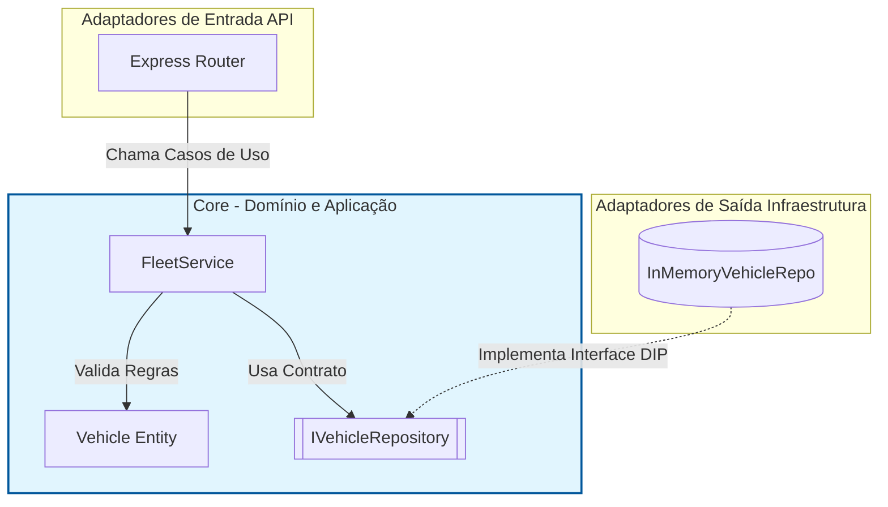

# Projeto de Arquitetura de Software - Fase 1: Monólito Modular

**Mestrado em Informática Aplicada** **Tema de Negócio:** Sistema de Telemetria e Gestão de Frota  
**Objetivo da Fase:** "Limpar a Casa" - Organização, Abstração e Inversão de Dependência.

---

## 1. Enquadramento e Requisitos Não Funcionais (RNF)
**O Problema:** A empresa necessita de um sistema de Telemetria e Gestão de Frota que evoluirá futuramente para suportar processamento assíncrono (recolha massiva de dados de GPS) e múltiplos domínios (veículos e viagens). Nesta primeira fase, o objetivo é construir o núcleo duro (Core) do domínio de Veículos.

### Justificação do Monólito na Fase 1
À luz dos requisitos atuais, a implementação de uma solução distribuída (Microserviços) **não se justifica nesta fase**. A complexidade de gerir rede, orquestração e resiliência entre serviços violaria o princípio de manter a solução simples enquanto o domínio ainda está a ser explorado. O Monólito Modular providencia a separação lógica necessária (preparando o terreno para extração futura de serviços) sem a sobrecarga operacional imediata.

### RNF Prioritários (Quantificados):
* **RNF1 - Manutenibilidade:** O sistema deve garantir uma clara separação de responsabilidades. O diretório `src/core` não deve conter nenhuma dependência externa no `package.json` além das nativas da linguagem.
* **RNF2 - Testabilidade:** O Core deve ser testável de forma isolada, com a suite de testes unitários a executar em menos de **100ms** (garantindo que não há I/O de rede ou disco).
* **RNF3 - Independência de Tecnologia:** Trocar o repositório em memória para PostgreSQL numa fase futura não deve exigir a alteração de **nenhuma linha de código** no `FleetService` ou no `Vehicle`.
### RNF Fase 2 - Assincronismo e Observabilidade:
* **RNF4 - Escalabilidade e Responsividade:** O sistema deve libertar o cliente HTTP imediatamente após pedidos de processamento intensivo (ex: relatórios), utilizando o padrão Web-Queue-Worker (WQW).
* **RNF5 - Observabilidade (Distributed Tracing):** Cada fluxo de trabalho tem de ser rastreável através de um `Correlation ID` único, desde a API até aos processos em *background*.
---

## 2. Arquitetura do Sistema
Adotámos a **Arquitetura Hexagonal (Ports & Adapters)** para garantir o cumprimento do **Princípio da Inversão de Dependência (DIP)**.

### Estrutura de Pastas:
- `src/core/`: O coração da aplicação. Contém apenas lógica de negócio pura.
    - `domain/`: Entidades e regras de validação (ex: `Vehicle`).
    - `ports/`: Contratos/Interfaces que definem o que a infraestrutura deve fazer (`IVehicleRepository`).
    - `services/`: Casos de uso que orquestram a lógica (`FleetService`).
- `src/infrastructure/`: Implementações técnicas (Adaptadores de Saída).
- `src/api/`: Porta de entrada para pedidos externos (Adaptadores de Entrada).
- `tests/`: Testes unitários focados no Core.

### Diagrama de Arquitetura Hexagonal


---

## 3. Registo de Decisões Arquiteturais (ADR)

### ADR 001: Adoção de Arquitetura Hexagonal
* **Data:** 28-04-2026
* **Estado:** Aceite
* **Contexto:** É necessário estruturar o sistema de forma a que a lógica de telemetria seja independente da persistência, permitindo a evolução para microserviços na Fase 3.
* **Decisão:** Utilizar o padrão Hexagonal com Inversão de Dependência. O Core não importa nada da infraestrutura; a infraestrutura é que implementa os Portos do Core.
* **Consequências:**
    * **Ganhos:** Elevada testabilidade e facilidade em trocar a base de dados no futuro.
    * **Perdas:** Maior verbosidade inicial (mais ficheiros e classes de interface).

### ADR 002: Persistência em Memória para a Fase 1
* **Data:** 28-04-2026
* **Estado:** Aceite
* **Contexto:** O enunciado da Fase 1 restringe o uso de bases de dados externas ou persistência complexa, focando-se na Prova de Conceito (POC).
* **Decisão:** Implementação de um `InMemoryVehicleRepo` utilizando um Array simples. Este adaptador cumpre a interface `IVehicleRepository`, permitindo que o serviço funcione sem IO de disco ou rede.
* **Consequências:**
    * **Ganhos:** Velocidade de desenvolvimento e facilidade de execução (não requer setup de BD).
    * **Perdas:** Os dados perdem-se sempre que a aplicação é reiniciada. Esta limitação é aceite para esta fase.

### ADR 003: Composition Root e Injeção de Dependências (DIP)
* **Data:** 28-04-2026
* **Estado:** Aceite
* **Contexto:** Para cumprir o Princípio de Inversão de Dependência (DIP), o Core não pode instanciar as suas próprias dependências de infraestrutura.
* **Decisão:** Criação de um *Composition Root* centralizado (`src/composition.js`). Este é o único ficheiro que conhece ambas as camadas, sendo responsável por instanciar os adaptadores concretos e injetá-los nos serviços do Core através do construtor.
* **Consequências:**
    * **Ganhos:** O `FleetService` mantém-se 100% agnóstico da tecnologia de persistência. Facilita a injeção de *mocks* nos testes unitários.
    * **Perdas:** Nenhuma significativa, apenas a centralização da configuração num único ponto.

### ADR 004: Interface REST com Express e Thin Controllers
* **Data:** 29-04-2026
* **Estado:** Aceite
* **Contexto:** Necessidade de expor as funcionalidades da frota através de uma interface HTTP para a Prova de Conceito (POC).
* **Decisão:** Utilização da framework Express.js para criar uma API REST. Foi adotado o padrão de *Thin Controllers*, onde as rotas são responsáveis apenas por: (1) Extrair dados do pedido; (2) Chamar o serviço do Core; (3) Devolver a resposta HTTP adequada.
* **Consequências:**
    * **Ganhos:** Garante que a lógica de negócio não é duplicada nem reside na camada de transporte (HTTP). Facilita a substituição da interface (ex: mudar de REST para GraphQL ou CLI) sem tocar no Core.
    * **Perdas:** Nenhuma para o âmbito deste projeto.

### ADR 005: Testes Unitários com Jest e Isolamento do Core
* **Data:** 29-04-2026
* **Estado:** Aceite
* **Contexto:** É necessário garantir a qualidade das regras de negócio sem depender de fatores externos (base de dados ou rede), cumprindo o RNF de Testabilidade.
* **Decisão:** Implementação de testes unitários utilizando a framework Jest. Graças à Arquitetura Hexagonal, injetamos o `InMemoryVehicleRepo` no `FleetService`, permitindo testar cenários de sucesso e de erro (ex: velocidade negativa) de forma isolada.
* **Consequências:**
    * **Ganhos:** Feedback instantâneo sobre a correção das regras de negócio. Execução de testes em milissegundos sem necessidade de setup de infraestrutura.
    * **Perdas:** Necessidade de manter mocks/implementações em memória sincronizadas com a lógica do core.

### ADR 006: Padrão Web-Queue-Worker (WQW)
* **Data:** 07-05-2026
* **Decisão:** Implementação de processamento assíncrono para tarefas pesadas (ex: Relatórios). A API devolve o estado `202 Accepted` e transfere a execução para *Workers* isolados.
* **Justificação:** Evita o bloqueio da *thread* principal do Node.js na API e permite o escalonamento independente.

### ADR 007: Estratégia de Distributed Tracing
* **Data:** 07-05-2026
* **Decisão:** Introdução de um `correlationId` obrigatório em todos os contratos das Interfaces (Ports) e Eventos, gerado num middleware da API.
* **Justificação:** Essencial para rastreabilidade (*tracing*) em sistemas assíncronos onde a execução é fragmentada.
---


## 4. Uso de Inteligência Artificial (IA)
Em conformidade com o enunciado, declaramos o uso de ferramentas de IA generativa:

| Ferramenta | Tarefa | Adaptação / Rejeição |
| :--- | :--- | :--- |
| Gemini / NotebookLM | Estruturação inicial do projeto | A estrutura de pastas sugerida foi aceite integralmente para cumprir os requisitos da UC. |
| Gemini | Implementação da Entidade de Domínio | Adaptada a lógica de validação do `Vehicle` para garantir que a velocidade nunca seja negativa. |
| Gemini | Documentação README | Estrutura de ADR baseada nos resumos das aulas. |
| Gemini | Implementação de Adaptadores de Infraestrutura | Gerado o repositório em memória e o serviço de autenticação básico, garantindo que herdam corretamente dos portos do Core. |
| Gemini | Criação do Ficheiro de Composição (DIP) | O código base foi gerado pela IA, mas adaptado manualmente para otimizar os *exports*. |
| Gemini | Criação de Testes Unitários | Gerada a estrutura do ficheiro de teste e os casos de teste para o `FleetService`. |
| Utilizador | Correção e Execução de Testes | Identificação e correção do erro de deteção de ficheiros do Jest e validação da execução no terminal. |
| Gemini | Fase 2: Padrões Assíncronos (WQW) | Implementação do JobQueue e JobStore em memória seguindo o DIP, e do ReportWorker. |
| Gemini | Fase 2: Observabilidade | Criação do middleware de Tracing para propagação do Correlation ID. |
| Utilizador | Refatorização de Resiliência (Fase 2) | O código base do `ReportWorker` gerado pela IA foi reescrito manualmente para otimizar a gestão do Event Loop e garantir o correto tratamento de erros (error handling) nos casos de falha do sistema. |

---

## 5. Como Executar (POC)

1. Instalar dependências: `npm install`
2. Iniciar o servidor da API: `npm start`
3. Executar Testes Unitários: `npm test`

### Testar a API (via Postman / cURL)

**Registo de um novo veículo:**

* **Método:** `POST`
* **URL:** `http://localhost:3000/api/vehicles`
* **Headers:**
  * `Content-Type: application/json`
  * `Authorization: super-secret-token-fase1`
* **Body (JSON):**

```json
{
  "id": "v1",
  "licensePlate": "AA-00-XX",
  "brand": "Tesla",
  "currentSpeed": 50
}